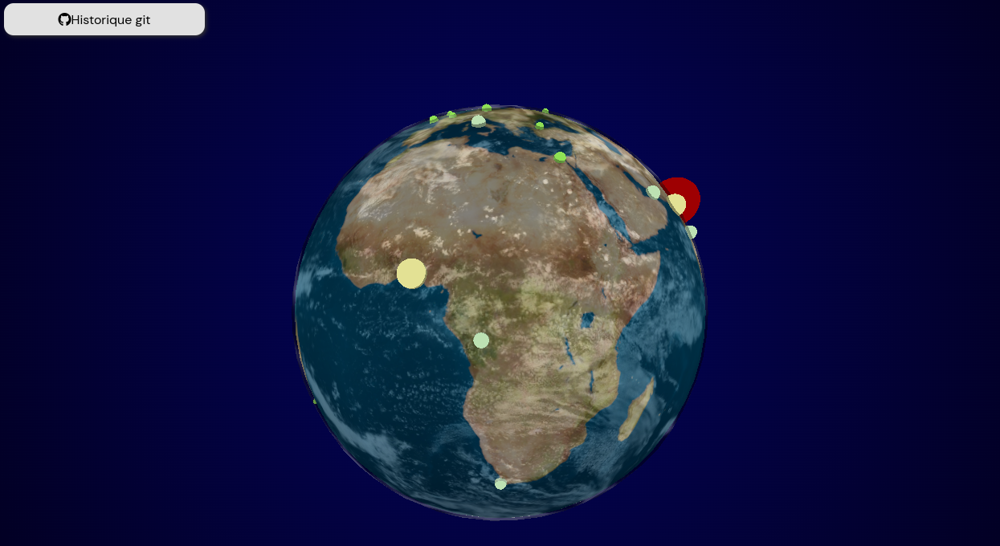

  

# MasterJS: Globe 3D avec niveaux de pollution quotidiens

[Accès à l'application ici](http://bastientlc.freeboxos.fr:3000)

## Introduction

Cette application web propose une expérience interactive permettant de visualiser en 3D un globe terrestre tout en affichant des niveaux de pollution provenant de diverses unités de mesure. Les données de pollution incluent des paramètres tels que le monoxyde de carbone, la pression atmosphérique, la température, et bien d'autres.

## Données de Pollution

Les données de pollution suivantes sont utilisées pour afficher les niveaux de pollution de différentes villes sur le globe :

### Monoxyde de Carbone
- Type de données : ppm (parties par million)
- Description : Concentration en parties par million (ppm) de monoxyde de carbone (CO) dans l'air. Mesure la quantité de CO, un gaz toxique, présent dans l'atmosphère.

### Dew (Rosée)
- Type de données : °C
- Description : Température de rosée (Dew) en degrés Celsius. Indique la température à laquelle l'air doit être refroidi pour atteindre la saturation et provoquer la condensation de la rosée.

### Humidité
- Type de données : Pourcentage (%)
- Description : Pourcentage d'humidité dans l'air. Mesure la quantité d'eau vaporisée présente dans l'atmosphère par rapport à la quantité maximale possible.

### Dioxyde d'Azote
- Type de données : ppb (parties par milliard)
- Description : Concentration en parties par milliard (ppb) de dioxyde d'azote (NO2) dans l'air. Indique la présence de ce polluant atmosphérique, souvent émis par les véhicules et les processus industriels.

### Ozone
- Type de données : ppb (parties par milliard)
- Description : Concentration en parties par milliard (ppb) d'ozone (O3) dans l'air. Mesure la quantité d'ozone, un gaz souvent présent dans la haute atmosphère, mais considéré comme polluant à des concentrations élevées au niveau du sol.

### Pression Atmosphérique
- Type de données : hPa (hectopascal)
- Description : Pression atmosphérique en hectopascals (hPa). Indique la force exercée par l'atmosphère sur une unité de surface et est souvent utilisée pour prédire les conditions météorologiques.

### Particules < 10µm
- Type de données : µg/m³ (microgrammes par mètre cube)
- Description : Concentration en microgrammes par mètre cube (µg/m³) de particules fines de moins de 10 micromètres dans l'air. Mesure la présence de particules susceptibles d'affecter la qualité de l'air et la santé respiratoire.

### Particules < 2.5µm
- Type de données : µg/m³ (microgrammes par mètre cube)
- Description : Concentration en microgrammes par mètre cube (µg/m³) de particules fines de moins de 2.5 micromètres dans l'air. Similaire au critère précédent, mais avec une taille de particules plus petite.

### r (Rayon)
- Type de données : Aucune unité spécifiée
- Description : Rayon (r) sans unité spécifiée. Peut représenter une valeur utilisée dans le contexte de la modélisation ou des calculs spécifiques.

### Dioxyde de Soufre
- Type de données : ppb (parties par milliard)
- Description : Concentration en parties par milliard (ppb) de dioxyde de soufre (SO2) dans l'air. Indique la présence de ce polluant souvent émis par les processus industriels.

### Température
- Type de données : °C
- Description : Température en degrés Celsius. Mesure la chaleur de l'air, influençant les conditions météorologiques et le confort thermique.

### Vitesse du Vent
- Type de données : m/s (mètres par seconde)
- Description : Vitesse du vent en mètres par seconde. Indique la rapidité du déplacement de l'air à une localisation donnée.

### wd (Direction du Vent)
- Type de données : Degrés
- Description : Direction du vent en degrés. Indique la direction vers laquelle le vent souffle.

### wg (Vitesse du Vent Rafale)
- Type de données : m/s (mètres par seconde)
- Description : Vitesse du vent en rafales, mesurée en mètres par seconde. Indique la rapidité maximale du vent sur une période donnée.

## Conclusion

Cette application offre une représentation visuelle et interactive des niveaux de pollution à travers le globe, facilitant la compréhension de l'impact de divers facteurs environnementaux.

This section has moved here: [https://facebook.github.io/create-react-app/docs/deployment](https://facebook.github.io/create-react-app/docs/deployment)

### `npm run build` fails to minify

This section has moved here: [https://facebook.github.io/create-react-app/docs/troubleshooting#npm-run-build-fails-to-minify](https://facebook.github.io/create-react-app/docs/troubleshooting#npm-run-build-fails-to-minify)
